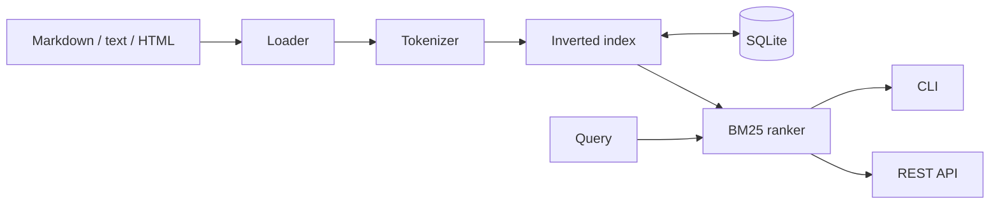

# TinySearch Lab

**A small search engine built from first principles.** TinySearch turns a folder
of text documents into a searchable SQLite index, ranks results with BM25, and
serves them through both a command-line interface and a REST API.

This project is intentionally compact enough to understand end to end while
still demonstrating core computer-science and software-engineering concepts.

## What it demonstrates

- An **inverted index** implemented with hash maps and postings lists
- **BM25** relevance ranking with title boosting and length normalization
- Explainable scores with matched terms and per-term contributions
- Transactional **SQLite** persistence
- A typed **FastAPI** service with interactive OpenAPI documentation
- A practical CLI, automated tests, Docker packaging, and GitHub Actions CI

## Architecture



## Quick start

```bash
python -m venv .venv
source .venv/bin/activate  # Windows: .venv\Scripts\activate
pip install -e ".[dev]"

tinysearch --db tinysearch.db index data/sample
tinysearch --db tinysearch.db search "inverted index"
pytest
```

Run the API:

```bash
tinysearch --db tinysearch.db serve --host 0.0.0.0 --port 8000
```

Then open `http://localhost:8000/docs`, or query it directly:

```bash
curl "http://localhost:8000/search?q=inverted%20index&limit=3"
```

## Example result

```text
1. Information Retrieval and BM25  score=4.2160
   A search engine builds an inverted index mapping each term to the documents...
   matched: index, inverted
```

The exact score depends on the indexed corpus.

## API

| Method | Endpoint | Purpose |
|---|---|---|
| `GET` | `/health` | Liveness check |
| `GET` | `/stats` | Corpus and index statistics |
| `GET` | `/search?q=...` | Ranked, explainable results |
| `POST` | `/documents` | Add and persist one document |

## Engineering choices

- **BM25 over raw term counts:** a proven lexical baseline that is understandable and testable.
- **In-memory ranking + SQLite persistence:** keeps the algorithm visible without losing durable state.
- **Term-level explanations:** makes relevance debugging possible instead of returning an opaque score.
- **Standard-library core:** the retrieval engine has no runtime dependency on the web framework.

See [docs/architecture.md](docs/architecture.md) for the ranking formula and design boundaries.

## Benchmark

Run a reproducible local micro-benchmark (10,000 generated documents, 100 queries):

```bash
python scripts/benchmark.py
```

Results depend on hardware and are printed rather than hard-coded.

## Roadmap

- Incremental update and delete operations
- Unicode-aware tokenization and optional stemming
- Field-specific BM25F ranking
- Phrase queries and prefix search
- Evaluation with precision@k and mean reciprocal rank

## License

[MIT](LICENSE) © 2026 Grace Huang
